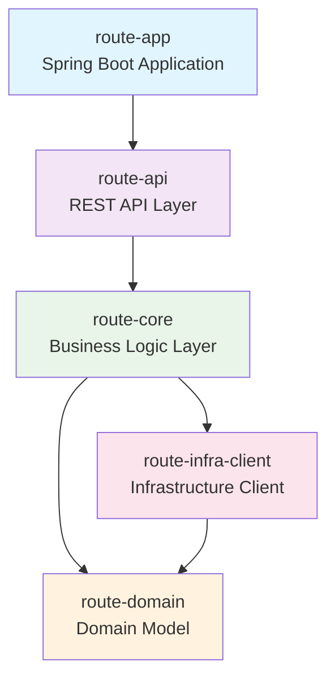

# Rapid Route - 배송 경로 최적화 시스템

## 프로젝트 개요
배송 경로를 최적화하는 시스템으로, 멀티모듈 아키텍처를 기반으로 구성되어 있습니다.

## 프로젝트 구조

### 모듈 구성
- **route-app**: Spring Boot 애플리케이션 진입점
- **route-api**: REST API 컨트롤러 및 웹 계층
- **route-core**: 비즈니스 로직 및 서비스 계층
- **route-domain**: 순수 도메인 모델 및 엔티티
- **route-infra-client**: 외부 시스템 연동 클라이언트

## 모듈 의존성 구도



### 의존성 설명
- **route-app** → **route-api**: 애플리케이션에서 API 계층 사용
- **route-api** → **route-core**: API에서 비즈니스 로직 호출
- **route-core** → **route-domain**: 비즈니스 로직에서 도메인 모델 사용
- **route-core** → **route-infra-client**: 비즈니스 로직에서 외부 시스템 연동
- **route-infra-client** → **route-domain**: 인프라 클라이언트에서 도메인 모델 사용

## 아키텍처 특징
- **Clean Architecture** 원칙 적용
- **Domain-Driven Design** 기반 설계
- **의존성 역전** 원칙 준수 (도메인 모델이 최하위 계층)
- **멀티모듈** 구조로 관심사 분리

## 기술 스택
- **Java 24**
- **Spring Boot 3.5.6**
- **Gradle**
- **Lombok**

## 빌드 및 실행
```bash
# 전체 프로젝트 빌드
./gradlew build

# 애플리케이션 실행
./gradlew :route-app:bootRun
```
